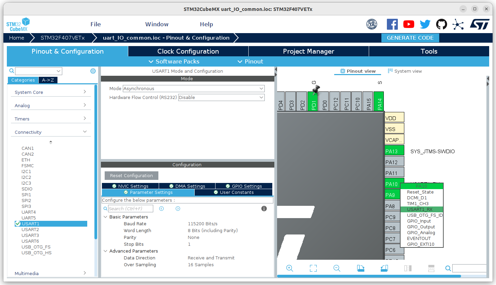
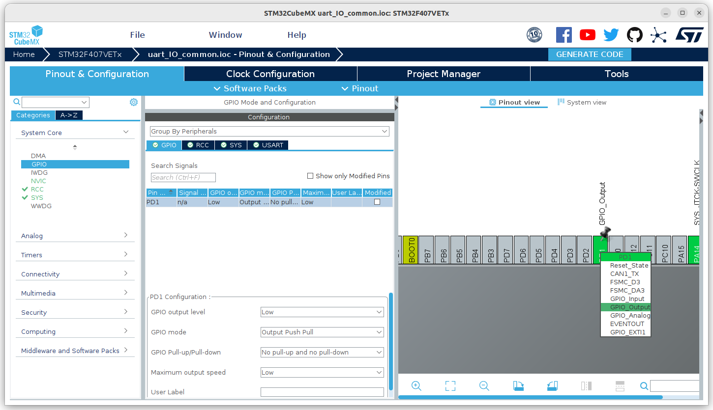
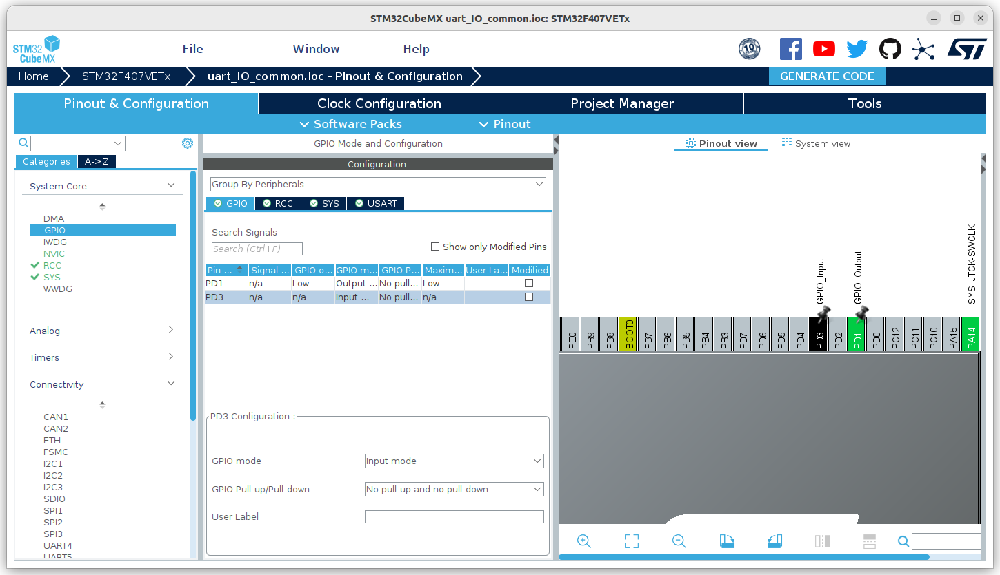

# 这是一个通过STM32CubeMX创建的串口&IO输出工程
## 工程概述
+ 串口配置成普通的输出模式，没有中断输入配置，没有DMA等功能，用于输出日志
+ IO配置成普通的输出模式，可以控制LED、蜂鸣器等

## 1、创建过程
省略了基本配置，只展示串口相关配置和IO相关配置

### 1.1、串口配置
+ 在Pinout&Configuration->Connectivity选择USART1，Mode选择Asynchronous，其它默认

- 波特率选择115200，可根据对端需求修改，一般如果日志量大（即传输数据量大），则可设置更大的波特率，如921600、1500000等
- 其它设置默认，一般不用修改

### 1.2、IO输出配置
+ 在Pinout&Configuration->Pinout view界面，选中要配置的io，选择GPIO_Output
+ 在Pinout&Configuration->System Core->GPIO，会出现刚才配置的io，点击这个条目，会出现基本配置，保持默认

- GPIO output level：IO配置成输出模式时，GPIO初始化后，IO口默认电平
- GPIO mode：GPIO模式，输出时一般配置成推挽输出，开漏输出没有带载能力
- GPIO Pull-up/Pull-down：IO配置成输入模式时，内部是上拉还是下拉
- Maximum output_speed：输出速率，一般配置成LOW

### 1.3、IO输入配置
+ 在Pinout&Configuration->Pinout view界面，选中要配置的io，选择GPIO_Input
+ 在Pinout&Configuration->System Core->GPIO，会出现刚才配置的io，点击这个条目，会出现基本配置，保持默认

- GPIO mode：GPIO模式，输入时只能配置成输入模式
- GPIO Pull-up/Pull-down：IO配置成输入模式时，内部是上拉还是下拉
- Maximum output_speed：输出速率，一般配置成LOW

## 2、代码分析

### 2.1、包含头文件
+ 串口格式化数据需要用到的库函数的头文件

```
...
/* Private includes ----------------------------------------------------------*/
/* USER CODE BEGIN Includes */
#include "stdarg.h"
#include "stdio.h"
/* USER CODE END Includes */
...
```

### 2.2、串口输出函数
+ 定义一个名为uart_printf的函数，封装了对库函数HAL_UART_Transmit的调用，方便直接使用该函数输出日志。
```
...
/* USER CODE BEGIN PFP */
int uart_printf(char *fmt, ...);
/* USER CODE END PFP */
...
/* USER CODE BEGIN 4 */
int uart_printf(char *fmt, ...) {
  char sprint_buf[500];
    va_list args;
    int n;
    va_start(args, fmt);
    n = vsprintf(sprint_buf, fmt, args);
    va_end(args);
    HAL_UART_Transmit(&huart1, (uint8_t *) sprint_buf, n, n);
  return 0;
}
/* USER CODE END 4 */
```
### 2.3、功能代码
+ 串口输出，使用之前定义的uart_printf函数，可以直接输出日志
```
...
/* USER CODE BEGIN 3 */
    ////uart test
    uart_printf("This is uart test\r\n");
```

+ IO输出，使用库函数HAL_GPIO_WritePin可直接控制输出电平，使用库函数HAL_GPIO_TogglePin可调换输出电平
```
...
////GPIO output test
//    HAL_GPIO_WritePin(GPIOD, GPIO_PIN_1, GPIO_PIN_SET);////Set GPIO high
//    HAL_GPIO_WritePin(GPIOD, GPIO_PIN_1, GPIO_PIN_RESET);////Set GPIO low
    HAL_GPIO_TogglePin(GPIOD, GPIO_PIN_1);
```

+ IO输入，使用库函数HAL_GPIO_ReadPin，可以返回指定IO口的电平，高电平1，低电平0
```
...
////GPIO input test
    int pd_3_value = HAL_GPIO_ReadPin(GPIOD, GPIO_PIN_3);
    uart_printf("PD3 value = %d\r\n", pd_3_value);
```

+ 延时，使用库函数HAL_Delay延时指定时间，参数1000代表1s
```
...
HAL_Delay(1000);
```
